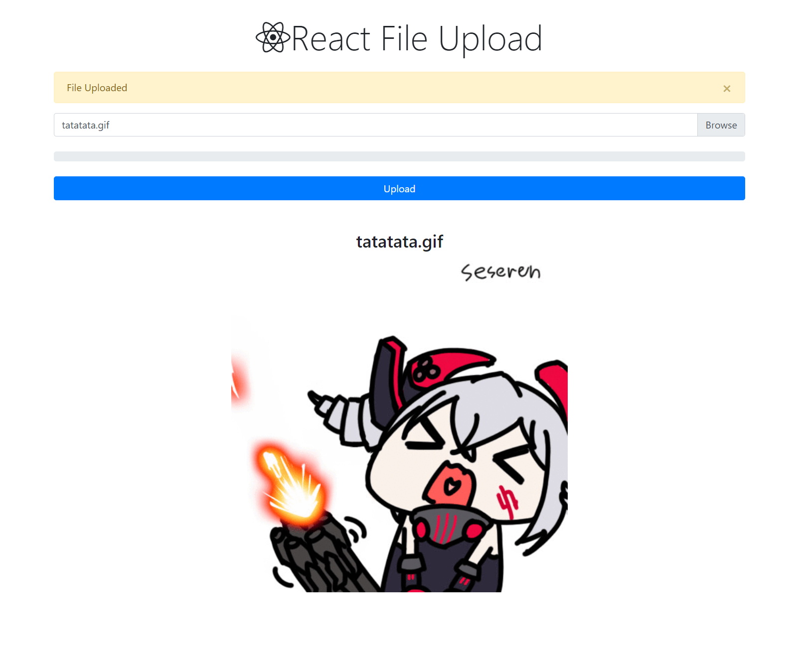

# Aplicacion web para subir archivos a servidor local

Realizado con Reactjs con axios y Express con express-fileupload



Para instalar aplicacion ejecutar en la carpeta raiz y cliente:

```
npm install
```

Para iniciar aplicacion ejecutar

```
npm run dev
```

------
